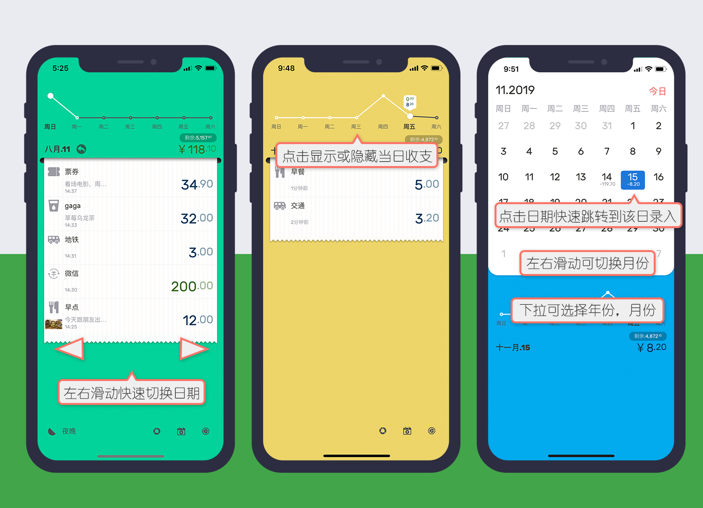
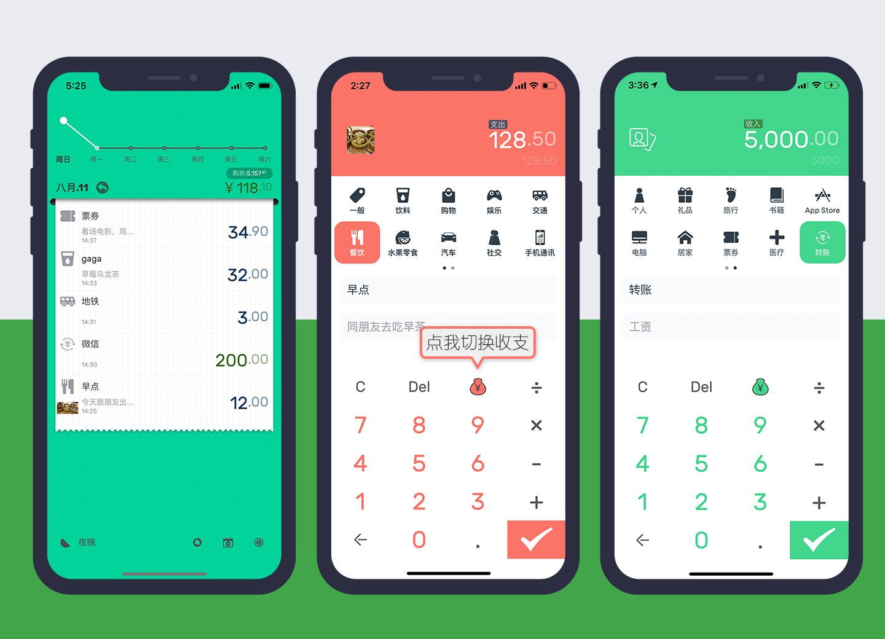
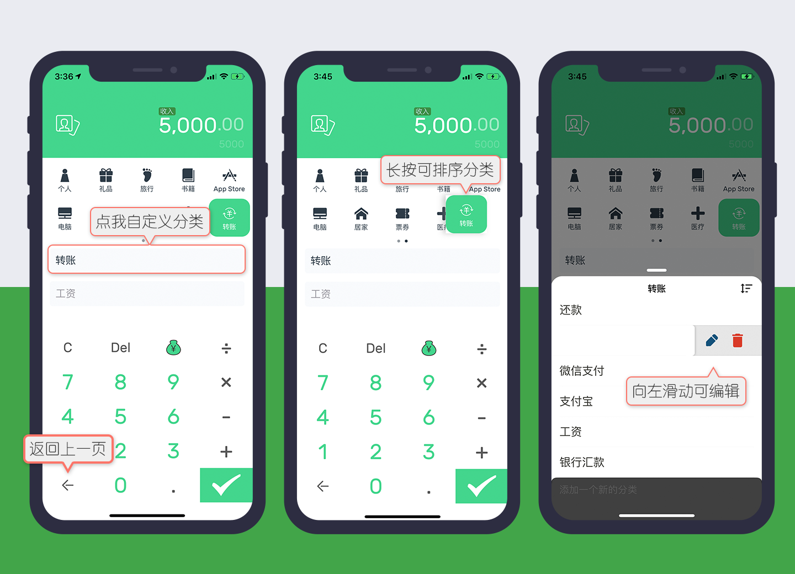
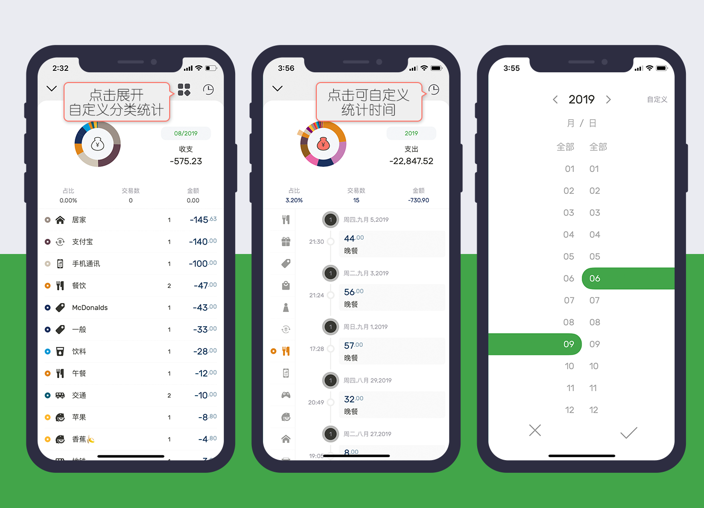
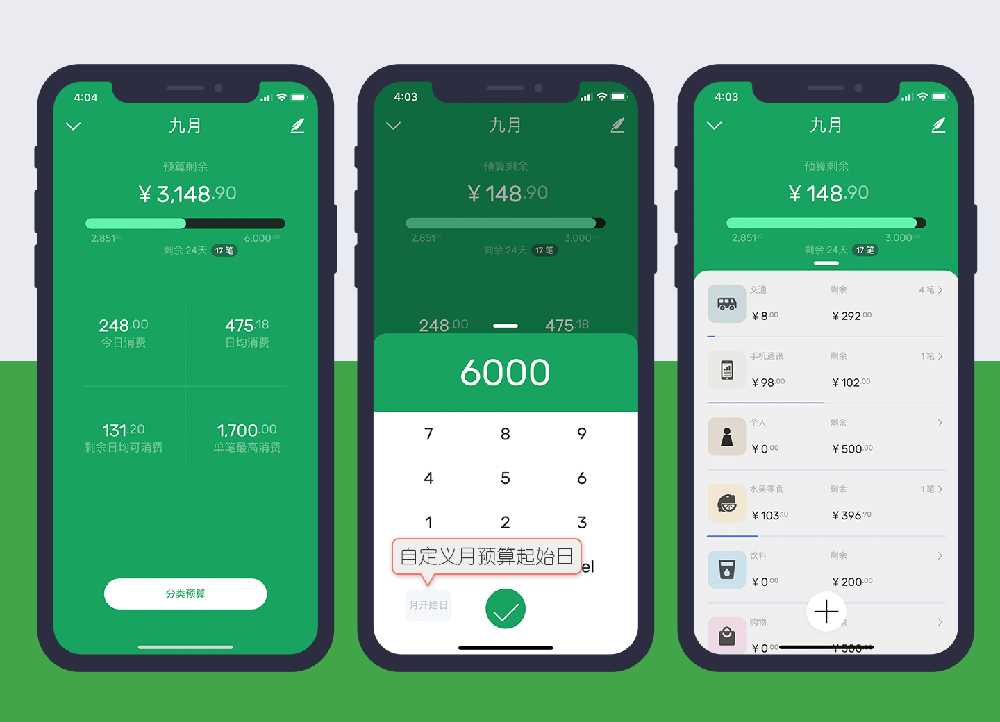

#【DailyBill】精致个人记账软件帮助文档

##首页说明

* 左右滑动快速切换当前日期
* 点击顶部折线图可显示当日收支情况
* 点击右下角 **日历** 图标可以弹出日历选择器，点击日期可快速定位到日期的收支小票

##录入说明

* 首页下拉即可进入 **支出/收入** 的录入界面
* 点击 **钱袋子** 可切换当前 **支出/收入** 模式
* 点击 **图片** 可添加图片附件

* 点击 **中间分类标题** 可进入自定义设置的分类
* **自定义分类** 左滑可编辑操作
* 长按 **分类图标** 可进行排序

##统计说明

* 点击 **钱袋子** 可切换 **收入/支出** 模式
* 点击 **日期** 可快速切换 月/年/日 时间段统计
* 点击 **四个方格图标** 可将自定义子分类进行单独统计显示
* 点击 **时钟图标** 可自定义统计开始及结束日期

##预算设置说明

理性消费，预算设置不仅可以按照整月设置，也可以自定义月的起始日。同时可单独设置20个大类的预算金额。

